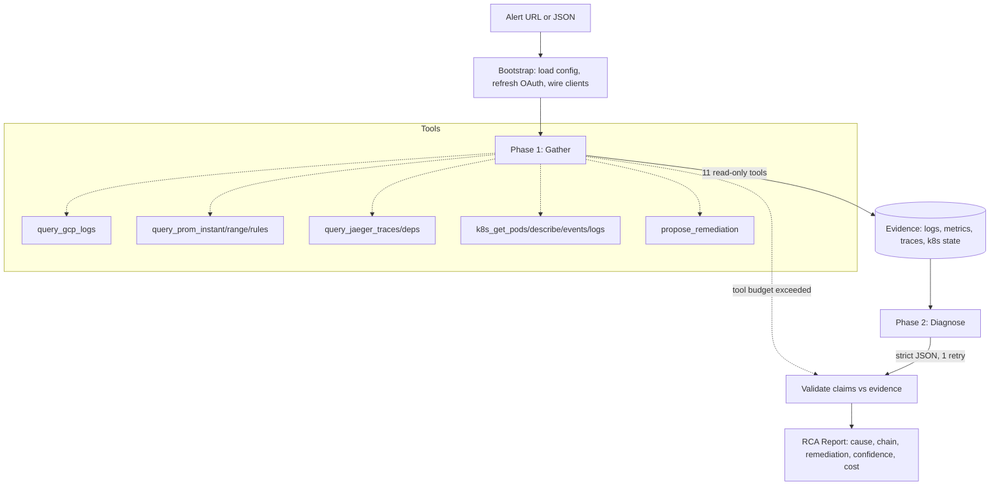

# OpsRemedy

> **Personal project — limited support.** Built for my own workflow. Issues and PRs welcome but I make no commitments to respond, fix, or maintain. Use at your own risk.

AI SRE investigation agent. Paste a GCP Monitoring alert URL (or alert JSON), get a structured root-cause analysis grounded in your real Kubernetes cluster, Prometheus metrics, Jaeger traces, and Cloud Logging.

Two-phase agent: **gather** evidence with read-only tools, **diagnose** with strict-JSON output, then **validate** every claim against the collected evidence in code (LLM confidence is not trusted).

> **Credits**
> - Idea inspired by [Tracer-Cloud/opensre](https://github.com/Tracer-Cloud/opensre).
> - Agent runtime built on [`badlogic/pi-mono`](https://github.com/badlogic/pi-mono) — tool calling, parallel execution, OAuth subscription auth, multi-provider model abstraction.

## How it works



Read-only by design. `propose_remediation` records suggestions; nothing is ever executed against the cluster or cloud.

## Install

```bash
bun install
cd packages/cli && bun link            # registers `opsremedy` in ~/.bun/bin
export PATH="$HOME/.bun/bin:$PATH"     # add to ~/.zshrc to persist
```

## Onboard

Interactive wizard — picks LLM provider/model, GCP project, K8s context, Prometheus/Jaeger URLs. Auto-discovers `gcloud projects`, kubeconfig contexts, and probes localhost endpoints.

```bash
opsremedy onboard
```

Writes:
- `~/.config/opsremedy/config.yml` — non-secret settings
- `~/.local/share/opsremedy/credentials.yml` — API keys / OAuth tokens (chmod 600)

LLM auth supports either API key or OAuth subscription (Claude Pro/Max, ChatGPT Plus, Gemini CLI, GitHub Copilot).

## Investigate

```bash
# from a GCP Monitoring alert URL
opsremedy investigate --url 'https://console.cloud.google.com/monitoring/alerting/alerts/<id>?project=<project>'

# from a local alert JSON
opsremedy investigate -i alert.json

# write a markdown report alongside the JSON
opsremedy investigate --url '...' --markdown report.md

# trace every event to JSONL for replay/debugging
opsremedy investigate --url '...' --trace run.jsonl
```

Output: structured RCA on stdout (JSON), progress events on stderr, optional markdown sidecar.

## Bench

Synthetic scenarios with fixture clients — no real infra needed (still hits the LLM).

```bash
bun run bench                              # all scenarios
bun run bench -- --scenario 001-oom-kill   # one
```

Each scenario lives in `packages/bench/scenarios/<NNN-name>/` with `alert.json`, `gcp_logs.json`, `prom.json`, `jaeger.json`, `k8s.json`, and `answer.yml` (expected category + required keywords + optimal trajectory).

## Layout

| Package | Role |
| --- | --- |
| `core` | Orchestration: gather → diagnose → validate |
| `clients` | GCP / Prometheus / Jaeger / K8s adapters (Real + Fixture) |
| `tools` | 11 `AgentTool` factories |
| `cli` | Entry point, onboard wizard, GCP URL fetch |
| `bench` | Scenario runner + 6-dimension scoring |

## Caveats

- Runs against your **configured K8s context** — that may be production. Read-only, but logs and pod state flow to the LLM.
- GCP Monitoring incident API is in Public Preview; some projects fall back to AlertPolicy lookups.
- Default LLM is `claude-sonnet-4-5`; switch in onboard or via `OPSREMEDY_LLM_MODEL` env.

See [`AGENTS.md`](./AGENTS.md) for development conventions.
