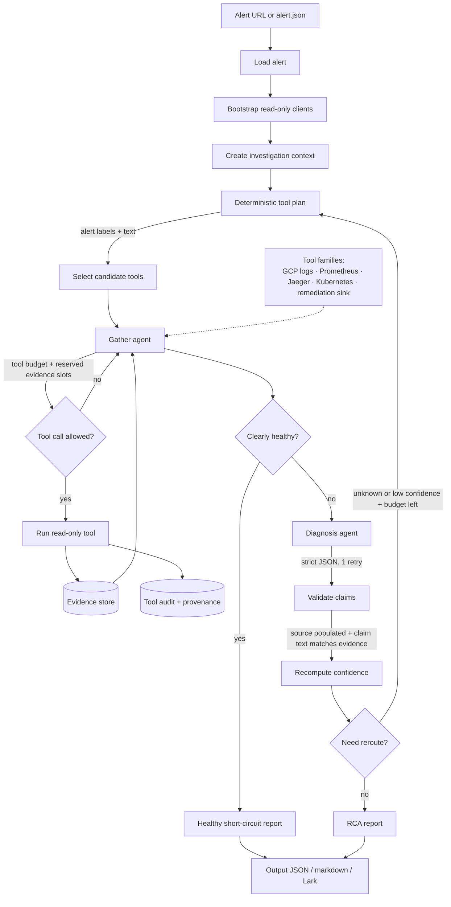

<p align="center">
  <picture>
    <source media="(prefers-color-scheme: dark)" srcset=".github/assets/logo-dark.png">
    <source media="(prefers-color-scheme: light)" srcset=".github/assets/logo-light.png">
    
  </picture>
</p>

<h1 align="center">OpsRemedy</h1>

> **Personal project — limited support.** Built for my own workflow. Issues and PRs welcome but I make no commitments to respond, fix, or maintain.

AI SRE investigation agent. Paste a GCP Monitoring alert URL, get a structured root-cause analysis grounded in your real Kubernetes cluster, Prometheus metrics, Jaeger traces, and Cloud Logging.

Read-only by design. `propose_remediation` records suggestions; nothing executes against your cluster or cloud.

> **Credits**
> - Idea inspired by [Tracer-Cloud/opensre](https://github.com/Tracer-Cloud/opensre).
> - Agent runtime: [`badlogic/pi-mono`](https://github.com/badlogic/pi-mono) (tool calling, parallel exec, OAuth, multi-provider).

## How it works



## Get started

**1. Install**

```bash
git clone https://github.com/polo871209/opsremedy && cd opsremedy
bun install
cd packages/cli && bun link
export PATH="$HOME/.bun/bin:$PATH"   # add to ~/.zshrc to persist
```

**2. Onboard** — interactive wizard picks LLM provider/model, GCP project, K8s context, Prometheus/Jaeger URLs.

```bash
opsremedy onboard
```

LLM auth: API key or OAuth subscription (Claude Pro/Max, ChatGPT Plus, Gemini CLI, GitHub Copilot).

**3. Investigate**

```bash
# from a GCP Monitoring alert URL
opsremedy investigate --url 'https://console.cloud.google.com/monitoring/alerting/alerts/<id>?project=<project>'

# from a local alert JSON
opsremedy investigate -i alert.json

# write a markdown report alongside JSON output
opsremedy investigate --url '...' --markdown report.md
```

Output: structured RCA on stdout, progress events on stderr, optional markdown sidecar.

**Optional: Lark notifications** — push the RCA report to a Lark/Feishu chat as a color-coded message card.

1. Create a self-built app at <https://open.larksuite.com/app>; enable bot ability and add scope `im:message:send_as_bot`.
2. Add the bot to the target group; copy the chat_id.
3. Re-run `opsremedy onboard` and answer the Lark prompts (or set `OPSREMEDY_LARK_APP_ID`, `OPSREMEDY_LARK_APP_SECRET`, `OPSREMEDY_LARK_RECEIVE_ID`).
4. Default policy `non_healthy` skips healthy short-circuits. Force-send with `--lark`, force-skip with `--no-lark`.

## Bench

Synthetic scenarios with fixture clients — no real infra needed (still hits the LLM).

```bash
bun run bench                              # all scenarios
bun run bench -- --scenario 003-noisy-healthy
```

## Caveats

- Runs against your **configured K8s context** — may be production. Read-only, but logs and pod state flow to the LLM.
- GCP Monitoring incident API is in Public Preview; some projects fall back to AlertPolicy lookups.
- Default LLM: `claude-sonnet-4-5`. Override in onboard or via `OPSREMEDY_LLM_MODEL`.

See [`AGENTS.md`](./AGENTS.md) for development conventions.

## References

- [`googleapis/gcloud-mcp`](https://github.com/googleapis/gcloud-mcp) — tool-design reference.
